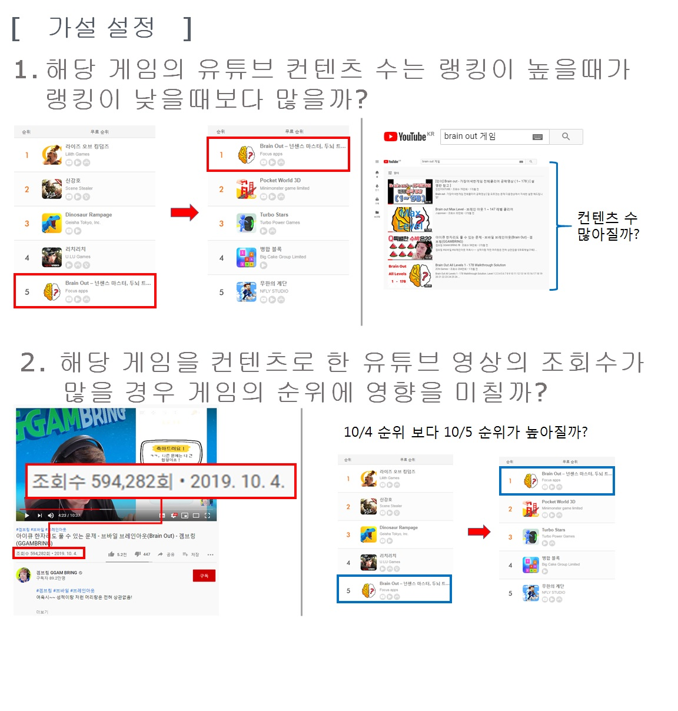
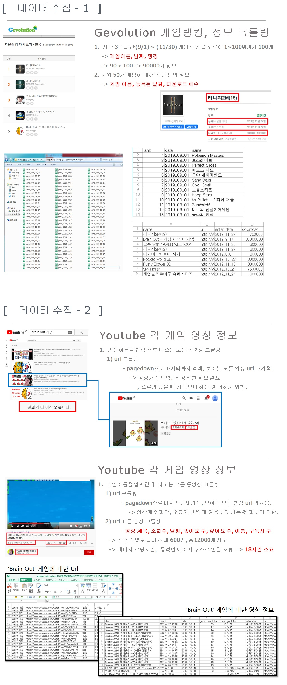
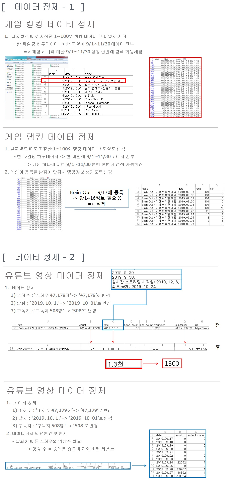
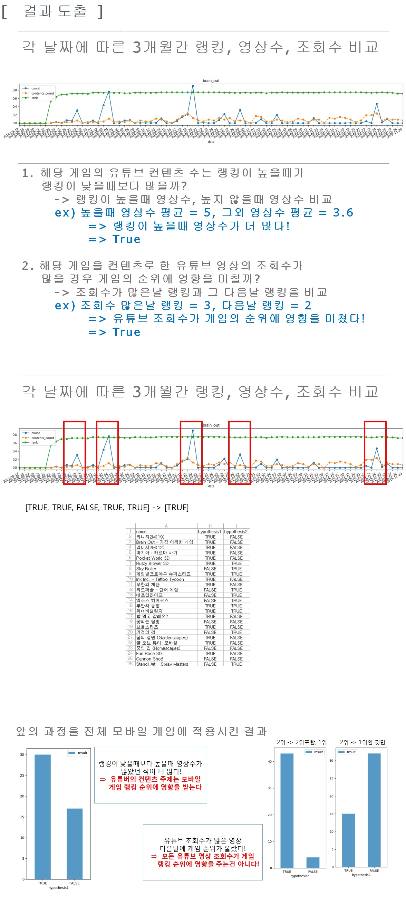

# GameYoutubeCrawling2019

# 기간
    1개월 (2019-11-11 ~ 2019-12-18)
    
    
    
# 개요
    유튜브 시장이 활발하게 진행되고 있는 현재 게임 유튜버가 모바일 게임에 대한 컨텐츠를 고르는 기준이
    게임 순위에 영향이 있는지 알아보기 위해 프로젝트를 진행했습니다.
    모바일 게임 순위와 유튜브의 관계를 분석해 결론을 도출했습니다.
    
    
    
# 사용한 라이브러리 및 구현 환경
    1. 구현 환경
        - Window 7
        - python 3.5
        
    2. 사용한 라이브러리 및 기능
        - Selenium 을 통해 모바일 게임 순위, 유튜브 정보 크롤링
        - Pandas 를 통해 데이터 정제 및 저장
        - matplotlib 를 사용한 그래프 표현
        
        
        
# 필요 기능과 과정
    1. 가설 설정
        - A라는 게임에 대한 유튜브 컨텐츠 수는 랭킹이 높을때가 낮을때보다 많을까?
        - A라는 게임을 컨텐츠로 한 유튜브 영상의 조회수가 많을 경우 게임의 순위에 영향을 미칠까?
        
    2. 모바일 게임랭킹 데이터 수집
        - Gevolution 사이트에서 데이터 수집
        - 게임이름, 날짜, 랭킹, 다운로드 회수 등 수집
        
    3. 유튜브 데이터 수집
        - 유튜브 영상 데이터 수집
        - 영상제목, 조회수, 날자, 좋아요 수, 싫어요 수, 이름, 구독자 수 등 수집
        
    4. 데이터 정제
        - 반정형으로 수집된 데이터들을 정제해 데이터 일반화시키기
        - [1.3천 -> 1300] or [구독자 508명 -> 508] 등 숫자만으로 정제
        
    5. 결과 도출
        - 유튜브 컨텐츠 수는 A라는 게임 랭킹이 높을 때 더 많았다
            => 유튜버의 컨텐츠 주제는 모바일 게임 랭킹 순위에 영향을 받는다
        - 유튜브 조회수가 많은 영상 다음날에 게임 순위가 올랐다
            => 모든 유튜브 영상 조회수가 게임 랭킹 순위에 영향을 주는건 아니지만
               순위가 올랐던 게임이 있다.
        
        
        
# 구현 화면

    
    
    
    

# 주요 파일 설명
## ***폴더내 zip 파일인 game_csv_files_and_data.zip을 그자리에 zip 해제해야 합니다.***
### 1. 게임랭킹 크롤링
| 파일 이름 | 파일 설명 | output |
|----------|-----------|--------|
| game6.py | 게임랭킹 9/1~11/29 크롤링 | project/csv파일들 |
| remove_index_from_csv.py | project/csv파일에서 index 삭제 | project2/csv파일들 |
| insert_date_to_csv.py | project2/csv파일에 date 추가 | project3/csv파일들 |
| processing_info_from_csv.py | project3/csv파일에서 50개 게임 랭킹 합침 | game_rank_data_top50.csv |

### 2. 게임정보 크롤링
| 파일 이름 | 파일 설명 | output |
|----------|-----------|--------|
| game_info_full.csv.py | 게임정보 50개 게임대해 크롤링 | game_info_full.csv |

### 3. youtube 크롤링(한개 게임 대해)
| 파일 이름 | 파일 설명 | output |
|----------|-----------|--------|
| youtube_url_crawling.py | 한개게임 검색 결과 대해 영상 url 크롤링 | youtube_게임이름_url.csv (youtube_brain_out_url.csv) |
| youtube_video_crawling.py | 위에서 크롤링한 영상 url대해 구체적인 영상 정보 크롤링 | youtube_게임이름_video.csv (youtube_brain_out_video.csv) |
| youtube_csv_processing.py | 크롤링한 csv파일 정제 | youtube_게임이름_video_regul.csv (youtube_brain_out_video_regul.csv) |
| youtube_video_get_count_each_date.py | 날짜에 따른 조회수, 영상수만 가져옴 | youtube_게임이름_count_each_date.csv (youtube_brain_out_count_each_date.csv) |

  
### 4. youtube 크롤링(전체 게임 대해)
| 파일 이름 | 파일 설명 | output |
|----------|-----------|--------|
| youtube_url_crawling_all.py | 전체 게임 검색 결과 대해 영상 url 크롤링 | youtube_game_data/youtube_게임이름_url.csv |
| youtube_video_crawling_all.py | 위에서 크롤링한 영상 url대해 구체적인 영상 정보 크롤링 | youtube_game_data/video/youtube_게임이름_video.csv |
| youtube_csv_processing_all.py | 크롤링한 csv파일 정제 | youtube_game_data/regul/youtube_게임이름_video_regul.csv |
| youtube_video_get_count_each_date_all.py | 날짜에 따른 조회수, 영상수만 가져옴 | youtube_game_data/count_each_date/youtube_게임이름_count_each_date.csv |

### 5. 게임, 유튜브 데이터 시각화 파일
| 파일 이름 | 파일 설명 | output |
|----------|-----------|--------|
| youtube_url_crawling_50games_count.py | 게임당 영상 개수 정리본 | youtube_url_crawling_50games_count.csv |
| youtube_graph_from_csv_with_line.py | 전체 게임에 대해 날짜별 랭킹, 조회수, 영상 수 그래프 그림 | graph_img_final/게임이름.png |

  
### 6. 가설 결과 및 시각화 파일
| 파일 이름 | 파일 설명 | output |
|----------|-----------|--------|
| youtube_video_get_hypothesis_result.py | 한개 게임 대해 가설에 따른 결과 계산 | 콘솔창에서 출력 |
| youtube_video_get_hypothesis_result_all.py | 여러 게임 대해 가설에 따른 결과 계산 | youtube_hypothesis_result.csv, youtube_hypothesis_result2.csv |
| youtube_video_get_hypothesis_graph.py | 위에서 나온 가설 결과에 따른 그래프 그림 | hypothesis_result.png, hypothesis_result2_1.png, hypothesis_result2_1.png |

